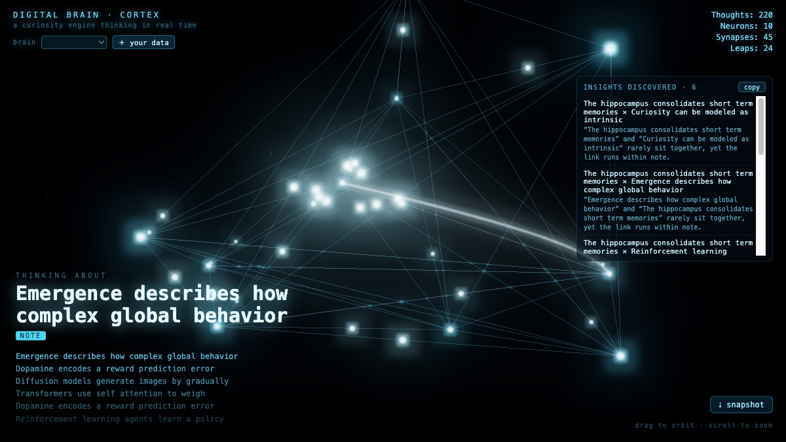
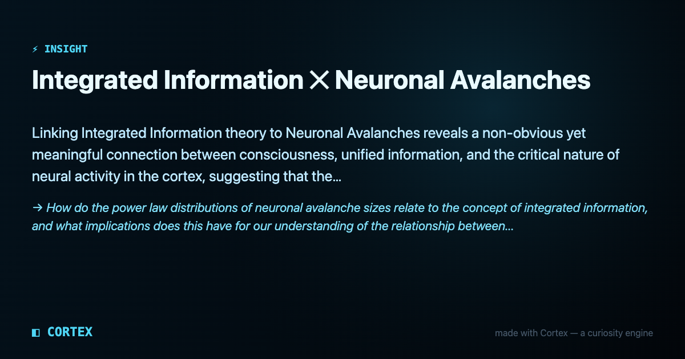

# Cortex

**Turn any corpus into a thinking brain — then read its mind for the non-obvious connections.**

Cortex embeds your notes, docs, or an AI-agent trace into a live 3D neural map:
each **concept becomes a neuron**, each **embedding similarity becomes a synapse**.
A spreading-activation engine animates the graph in real time — attending, spreading
activation, and making dream-jumps — while a scored, ranked set of **evidence-backed
Insight Cards** rolls up into an exportable **Insight Digest**. It runs **100% in
your browser** — no backend, no upload, no CDN.


**▶ [Live demo](https://cmonaco0317.github.io/cortex-mind/)** — runs entirely in your browser; nothing is uploaded.

---

## Why it exists

Most knowledge graphs are decorative — a pretty picture you look at once. Cortex is
built around the **output**: the graph is context, the *digest of non-obvious
connections* is the product. Pairs are scored, ranked most-surprising-first, and each
comes with a "why" backed by the numbers behind it and an angle to pursue.

### What "surprising" actually means here

Worth being precise, because it's the whole claim. A bridge is scored as

```
surprise = relatedness × (1 − neighbourhood overlap) × cross-domain bonus
```

all measured in the **full embedding space**. The interesting case isn't two things
that are far apart — those are just unrelated. It's a pair that is genuinely
*related* while sitting in two neighbourhoods that never touch: two clusters meeting
at a single point. Every card shows the cosine similarity and the measured neighbour
overlap it's asserting, so you can check the claim rather than take it.

Two honest notes on that:

- **The card text is composed from measurements, not generated,** in the in-browser
  path. Genuinely written explanations require a model, which the offline
  `build_brain.py` pipeline uses (via local Ollama) and the browser deliberately does
  not — that's the price of never phoning home.
- **A "concept" is a passage, not a whole document.** Files are split on their own
  structure — headings first, then paragraph breaks — so a note covering three ideas
  becomes three neurons instead of one blurred point sitting between all three. A
  blank line is treated as the author saying *"new idea"*, so passages are never
  repacked across one to hit a size target; only true fragments are glued to their
  neighbour, and a wall of text is cut on sentence boundaries. Each passage keeps a
  pointer back to its source document, and a single file is capped at 40 neurons so
  one long document can't drown out the rest of the graph.

  This matters for the scoring above: two passages of the *same* note are now the
  commonest high-similarity pair in the graph and the least interesting one — the
  author already wrote those ideas side by side, so nothing was discovered. They're
  discounted to 0.35× rather than allowed to crowd out genuine cross-source bridges.

  (Earlier versions made one neuron per file, truncated to 600 characters — which
  discarded most of a long note and made the graph document × document.)

## Try it

```bash
cd frontend
npm ci          # exact, reproducible install (pinned lockfile)
npm run dev     # then open the printed localhost URL
```

The default view is a 237-concept demo brain (AI / neuroscience / cognition) — hit
**⚡ all** in the Insight Digest panel to surface every connection at once.

> Serve it over http (the `npm run dev` URL, or the built `dist/`). Opening the
> files directly with `file://` breaks ES-module loading.

## Bring your own data

Click **＋ your data**, then drop a folder, pick files, paste text, or hand it an
**AI-agent trace** (`.md`, `.txt`, `.json`, `.jsonl`). Cortex embeds it **locally**
and builds the brain in-browser.



- **Provably local.** The embedding model (`all-MiniLM-L6-v2`) and the ONNX-runtime
  WebAssembly are **vendored into the app** — open your browser's Network tab while
  it embeds and you'll see requests to *only your own origin*, never a CDN.
- **Secret-safe.** API keys, tokens, and private keys are auto-redacted on ingest,
  before anything becomes a neuron or a shareable card.
- **Fault-tolerant.** If a file won't parse, Cortex tells you exactly why instead of
  silently producing an empty brain.

## The Insight Digest — the artifact

Each bridge emits an Insight Card: `concept A × concept B · why it's non-obvious · an
angle to explore`, carrying its surprise score, the cosine similarity and neighbour
overlap behind that score, and the source snippets. Cards come out ranked, highest
score first. Copy or download the whole digest as Markdown, or export any card as a
watermarked share image.

*(The engine's animated dream-jumps are a live traversal of this same graph — they're
what makes the visualisation move, not what decides which connections are worth
showing. The ranking above does that.)*



## How it works

| Layer | What it is |
|---|---|
| **Neurons** | your concepts, embedded with `all-MiniLM-L6-v2` (384-dim), laid out in 3D via PCA |
| **Synapses** | k-nearest-neighbour cosine similarity between concept embeddings |
| **Bridges** | related-but-non-adjacent pairs, scored by `relatedness × (1 − neighbour overlap) × cross-domain bonus` and sorted |
| **Curiosity engine** | live spreading-activation with an attend → spread → dream-jump policy; the firing is emergent, not scripted. It animates the graph — the ranking above, not the walk, selects which connections surface |
| **Insight Digest** | the ranked, evidence-backed export — the product |

## Tech

- **Local embeddings** — [`@xenova/transformers`](https://github.com/xenova/transformers.js) (all-MiniLM-L6-v2, quantized), running in WASM
- **Rendering** — `three.js` with UnrealBloom postprocessing
- **Build** — Vite + TypeScript; unit-tested with Vitest
- **Zero external runtime dependencies** — the model and wasm are committed under
  [`frontend/public/`](frontend/public); see [PROVENANCE](frontend/public/models/PROVENANCE.md)
  for exact files, sources, and licenses. Nothing is fetched at runtime.

## Also in this repo

Two extra, fully local tools ship alongside the web app:

### `agent-insights/` — read your own Claude Code sessions

A zero-dependency Python pipeline that turns your Claude Code `.jsonl` history into
one named **archetype** ("The Pouncer," "The Director," "The Surgeon"…) and a set of
ranked, shareable *"how you actually work with your AI agent"* cards — computed
entirely on your machine. It emits **aggregate stats only**: file paths are one-way
hashed, model names are collapsed to a coarse family, no prompt text is ever stored,
and a privacy tripwire hard-fails the run if anything path- or secret-shaped would be
written. See [`agent-insights/README.md`](agent-insights/README.md).

Archetypes are decided by **rates, not totals** — corrections per 100 prompts, not
corrections — so the label describes *how* you work rather than *how much*. (Absolute
counts appear only as minimum-sample gates; three prompts isn't a personality.) The
statistical mining underneath — Wilson score intervals on tool-success rates, an
order-2 Markov next-move model, high-lift move mining — is the rigorous part; the
archetype is the readable surface over it.

### `build_brain.py` — pre-bake a brain from a folder of notes (optional)

A local CLI that embeds a folder of markdown/text with a local model (Ollama
`nomic-embed-text`) and writes a brain JSON the web app can load — for when you'd
rather build the graph offline than in the browser. It also writes *generated*
explanations (via local `llama3.2`), which the browser path can't do.

`blind_test.py` + `corpus_safe.json` are a self-contained blind A/B harness that puts
a scored bridge and a plain nearest-neighbour side by side, shuffled and unlabelled,
and asks you to pick. It scores with an **exact two-sided binomial test against
chance**, and it will tell you the run was **inconclusive** — which, at n=20 with one
rater, is the honest answer most of the time. It deliberately has no "pass bar":
an earlier version passed the engine at ≥30% wins, which is at or below chance once
"neither" is an option, so it could print PASS while the baseline was actually
preferred twice as often. Read any result narrowly: one rater on one corpus is not
evidence of a general effect, and the harness says so in its own output.

## License

Cortex's own code is [MIT](LICENSE). Vendored components keep their own licenses:
the embedding model is Apache-2.0 and ONNX Runtime Web is MIT — details in
[PROVENANCE](frontend/public/models/PROVENANCE.md).

---

<sub>made with Cortex — a local curiosity engine. Nothing leaves your machine.</sub>
